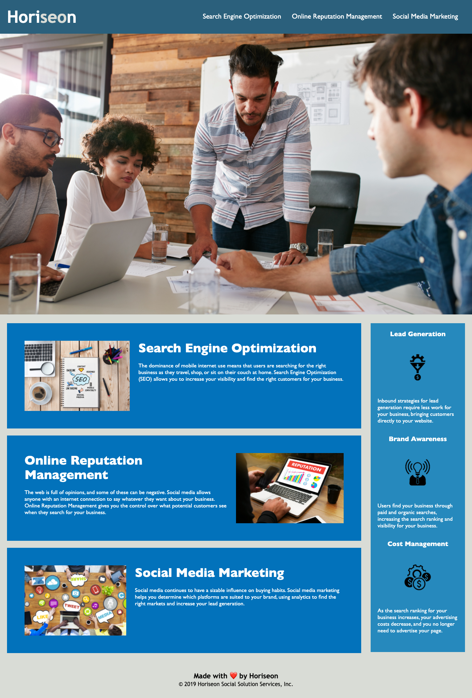

# Horiseon - Website

## Description
---
This is a website for a marketing firm. The firm focuses on web advertisment and brand awareness. The page highlights the main services the firm provides. The page also highlights the potential benefits that the firm's clients can come to expect from these services. The problem the agency faces is, "How do we clearly and concisely provide the firm's customers with a synopsis of all the services we provide, and how do we do so in a way that maximizes accessibility, increases our customer base and improves business?" Our motivation was to resolve and address these questions. The website provides a neat and effective solution to all these questions. The page provides the necessary information in an aesthetically pleasing and accessible way through the use of HTML and CSS. What makes this website stand out is its effective content and its use of CSS to elevate the experience and its use of HTML to increase accessibility. Through this project I developed and deepened my understanding of HTML and CSS, in particular the concepts and application of accessibility and DRY (Don't Repeat Yourself).I also learned a great deal about Markdown and the creation of README.md files. 

## Usage
---
To use website go to link provided below. To experience funtionallity 
<!-- link to deployed application -->
## Link to website/environment
---
[Horiseon](https://perfect-perfect.github.io/horiseon/)
## License
---
MIT License

Copyright (c) 2021 Gilberto Jesus Covarrubias Merino

Permission is hereby granted, free of charge, to any person obtaining a copy
of this software and associated documentation files (the "Software"), to deal
in the Software without restriction, including without limitation the rights
to use, copy, modify, merge, publish, distribute, sublicense, and/or sell
copies of the Software, and to permit persons to whom the Software is
furnished to do so, subject to the following conditions:

The above copyright notice and this permission notice shall be included in all
copies or substantial portions of the Software.

THE SOFTWARE IS PROVIDED "AS IS", WITHOUT WARRANTY OF ANY KIND, EXPRESS OR
IMPLIED, INCLUDING BUT NOT LIMITED TO THE WARRANTIES OF MERCHANTABILITY,
FITNESS FOR A PARTICULAR PURPOSE AND NONINFRINGEMENT. IN NO EVENT SHALL THE
AUTHORS OR COPYRIGHT HOLDERS BE LIABLE FOR ANY CLAIM, DAMAGES OR OTHER
LIABILITY, WHETHER IN AN ACTION OF CONTRACT, TORT OR OTHERWISE, ARISING FROM,
OUT OF OR IN CONNECTION WITH THE SOFTWARE OR THE USE OR OTHER DEALINGS IN THE
SOFTWARE.